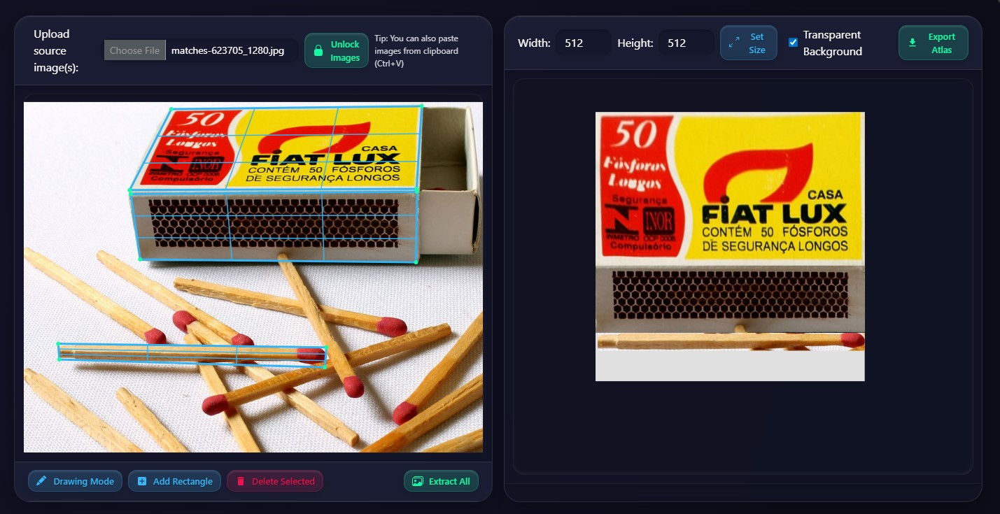
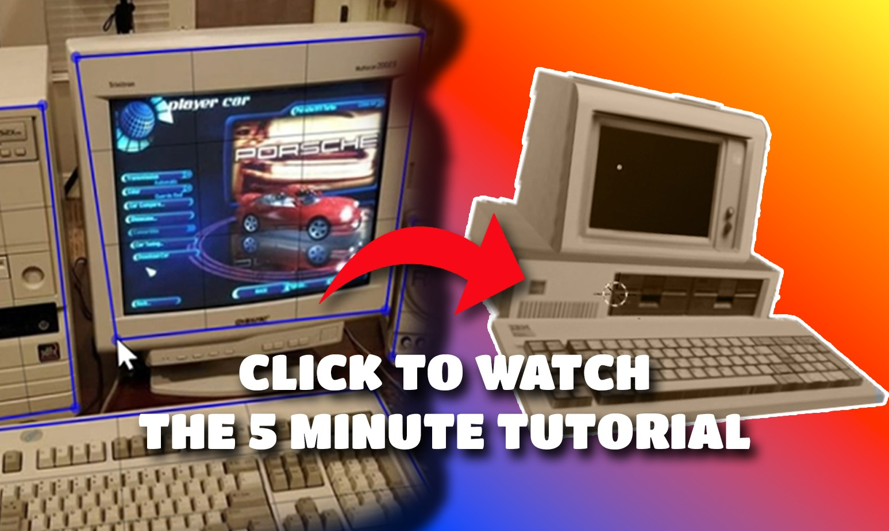

 👈 Click here to open the app

# Raycastly Texture Ripper

Raycastly Texture Ripper is a tool that lets you extract textures from angled or perspective photos — making it easier for artists and game developers to turn real-world images into usable assets.

This tool is based on the Shoebox Texture Ripper. I didn't like the controls on that tool and the fact that it was relying on deprecated software. So I decided to build my own version.

---

## ✨ Features
- 📐 **Perspective Correction** — automatically flatten angled regions into usable textures
- 🖼 **Batch Extraction** — extract textures from multiple images in one go
- 🎨 **Atlas Packing** — arrange, rotate, and scale textures into a single texture atlas
- ⚙️ **Output Control** — set texture resolution and transparency for exports
- 🔄 **90° Rotation Snapping** — quickly snap textures to standard angles
- 📏 **Guidelines & Position Snapping** — snap to edges, guides, and other textures for precise placement
- 🔧 **Multi-Select Transformations** — scale, rotate, and translate multiple textures at once
- 📐 **Uniform & Non-Uniform Scaling** — scale textures proportionally or freely along X/Y axes

---

## 🚀 How to Use

1. Go to [Raycastly Texture Ripper](https://raycastly.github.io/texture-ripper)
2. Upload one or more images
3. Lock the images so they don’t accidentally move
4. Add rectangles in two ways:
   - Press the **Add Rectangle** button and position the vertices
   - *(W.I.P.)* Enter **drawing mode** and draw the vertices
5. Press **Extract All** at any time to generate flattened textures
6. Use the right panel to set the output resolution of your texture atlas
7. Position, rotate, and scale the extracted textures within the atlas
8. Adjust polygons in the left panel and click **Extract All** again to refresh
9. Choose whether to export with a transparent background
10. Click **Export** — your textures are ready 🎉

---

## ⚠️ Known Issues
- Draw mode can get bugged if you pan with the middle mouse button in the middle of drawing a polygon
- Draw mode polygons sometimes extract lower-resolution textures; it’s best to use the **Add Rectangle** button instead
- Deleting all images in the left panel can prevent new images from loading until the page is refreshed
- Scaling extracted textures does not snap to edges yet
